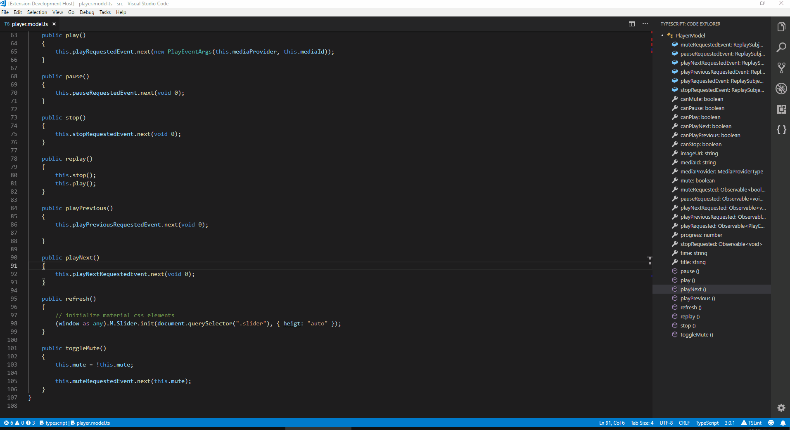
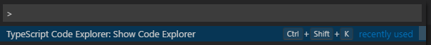
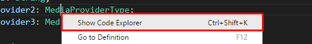

# TypeScript Code Explorer for VS Code
VS Code extension for navigating TypeScript code more easily.

## Features
View and navigate TypeScript code by using the custom view.

## Usage S

### Sidebar

### Command Palette
From the command palette you can:

* display the code explorer by invoking command "TypeScript Code Explorer: Show Code Explorer",

### Shortcuts

You can invoke command "TypeScript Code Explorer: Show Code Explorer" by using the shortcut Ctr + Shift + K. You can change the shortcut by assigning a different shortcut to command "tsce.showCodeExplorer".

### Context menu

You can invoke command "TypeScript Class Explorer: Show Code Explorer" by using the context menu item.

## Change log

### 1.0.0

Initial release.