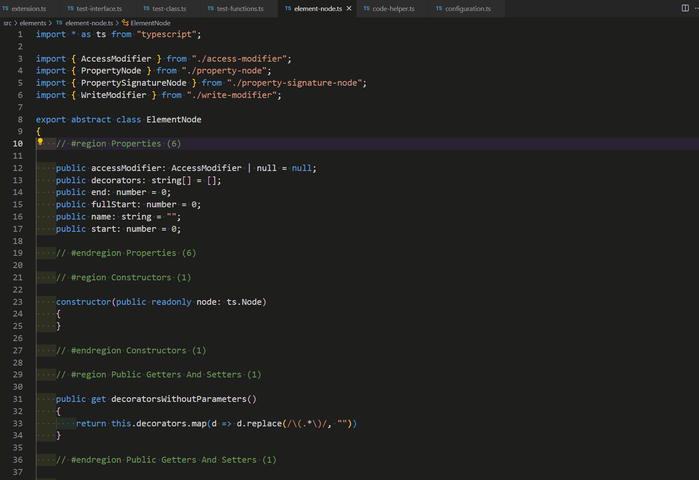

# TypeScript Code Explorer for VS Code

VS Code extension for navigating TypeScript code more easily.

## Features

View and navigate TypeScript code by using the custom tree view representing type members in a structured overview.

## Usage

### Sidebar

Sidebar allows you a visual representation of the currently open TypeScript source code file.

### Command Palette

From the command palette you can:

* display the code explorer by invoking command "TypeScript Code Explorer: Show Code Explorer",

### Shortcuts

You can invoke command "TypeScript Code Explorer: Show Code Explorer" by using the shortcut Ctr + Shift + K. You can change the shortcut by assigning a different shortcut to command "tsce.showCodeExplorer".

### Context menu

You can invoke command "TypeScript Class Explorer: Show Code Explorer" by using the context menu item.

## Configuration

* `groupingAndOrder` allows the user to choose between different modes of elements and members grouping and ordering of the element tree
* `showMemberTypes` allows the user to show member types in the element tree
* `showAccessorColorCoding` allows the user to display nodes in different color depending on the member access modifiers or whether an element is exported or not
* `showStaticMemberIndicator` allows the user to display an 'S' indicator in the member icon for static members
* `showAbstractMemberIndicator` allows the user to display an 'A' indicator in the member icon for abstract members
* `showReadonlyPropertiesAsConst` allows the user to display readonly properties as constants
* `showConstVariablesAsConst` allows the user to display const variables as constants
* `showArrowFunctionPropertiesAsMethods` allows the user to display arrow function properties as methods
* `showArrowFunctionReadOnlyPropertiesAsMethods` allows the user to display readonly arrow function properties as methods
* `showArrowFunctionVariablesAsMethods` allows the user to display arrow function variables as methods
* `showArrowFunctionConstPropertiesAsMethods` allows the user to display const arrow function variables as methods

## Change log

### 1.0.0

* initial release

### 2.0.0

* fixed code analysis issues
* added support for custom code element grouping and ordering
* added support for displaying member types
* added support for access modifier color coding
* added support for displaying static member indicator
* added support for displaying abstract member indicator
* added support for displaying async method and function indicator
* added support for displaying member group count
* added support for displaying readonly properties as constants
* added support for displaying const variables as constants
* added support for displaying arrow function properties as methods
* added support for displaying arrow function properties as methods
* added support for displaying readonly arrow function properties as methods
* added support for displaying arrow function variables as methods
* added support for displaying const function variables as methods
* fixed displaying non-async functions as async
* fixed incorrect ordering
